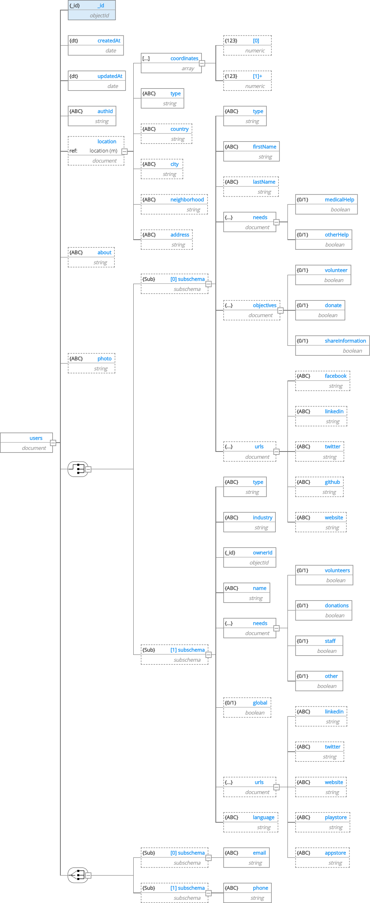
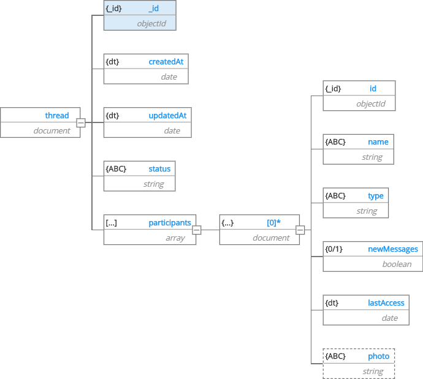
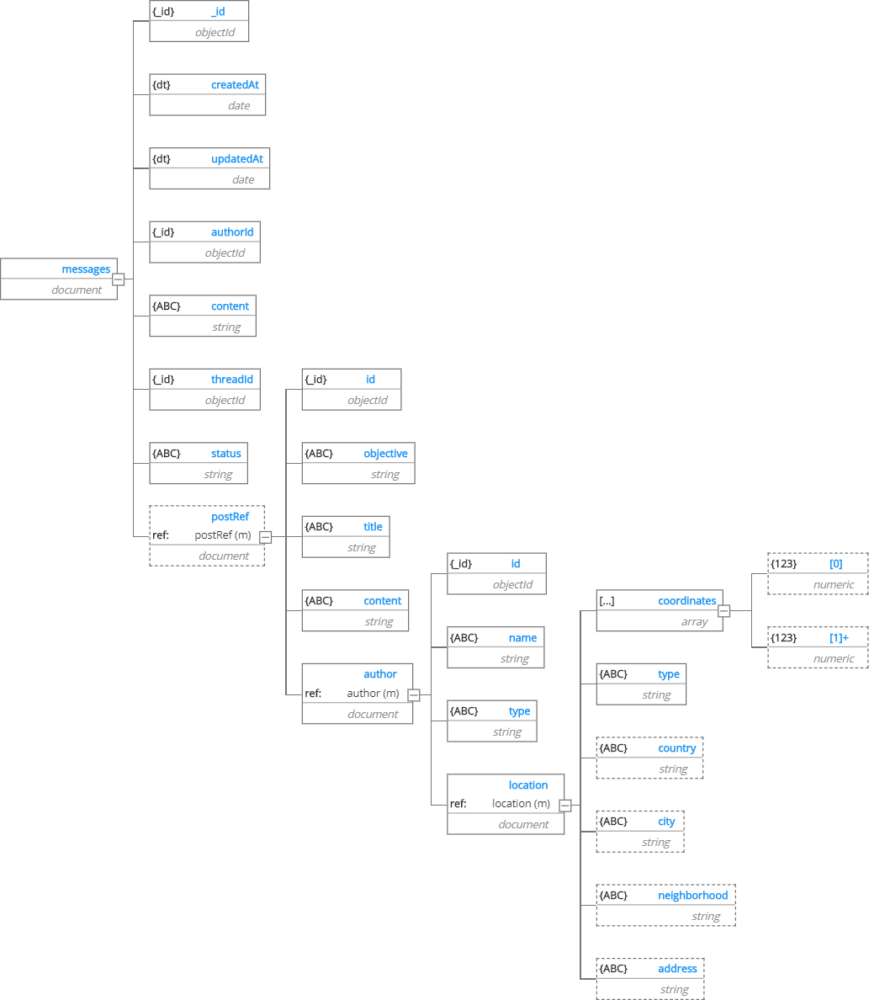

 

# FightPandemics Data Model

 

Repository holding the data model specified as json document, json schema and with its html and pdf documentation.
Release Notes:

- [v1- Outdated](/v1) - First Data Model, used in the hackathon app
- [v2 - Outdated](/v2) - Total rework of the data model into more organized and concise version.
- [v3 - Current](/v3) - Added support for private messages and notifications

 

The HTML documentation is hosted at Github Pages at the following URL: https://fightpandemics.github.io/DataModel/

## Diagram for the Data Model v3

  

 

# Documentation

The documentation can be found in [HTML](https://fightpandemics.github.io/DataModel/) and [PDF](v3/docs/FightPandemics_documentation.pdf). The HTML live version is highly recommended.

There is also an [excel spreadsheet version](v3/docs/FightPandemics.xlsx).

 

## Sample of the documentation

  

 

# Specifications and Scripts

There are [JSON Document](v3/scripts/JSON_Document) and [JSON Schema](v3/scripts/JSON_Schema) representations.

There are [MongoDB Scripts](v3/scripts/MongoDB_Script) available for collection creation, in JS with standard Mongo Shell flavor.

Mongoose scripts are in the roadmap for the near future.

# Collections

## Users

Collection that holds all the data on system's users.

The users can be of **two types**: **(1) Individual**, representing a private user account; and **(2) Organization**, representing an organization of various types.

The field 'type' is used to differentiate between the two subschemas, with 'individual' representing private user accounts and "Community", "Government", "Health care provider", "Non-profit", "Other", "R&D", "Startup", "Traditional Company" and "University".

For more detailed information, please visit the [documentation](https://fightpandemics.github.io/DataModel/).

 

  

 

## Posts

Document to represent a post, asking or offering help to be displayed on the feed. A post can be created by any user, wether it is an individual or an organization. A post can have it's visibility limited geographically and have an expiration date set.

For more detailed information, please visit the [documentation](https://fightpandemics.github.io/DataModel/).

 

  

 

## Comments

Document that represents a comment made at a post. A comment can be made by an individual user or an organization.

For more detailed information, please visit the [documentation](https://fightpandemics.github.io/DataModel/).

 

  

 

## Feedback

Document that represents a feedback sent by an user, logged or not.

For more detailed information, please visit the [documentation](https://fightpandemics.github.io/DataModel/).

 

  

 

## Threads

Document that represents a conversation between users. The participants array was used to allow expansion for group chats in the future, while the status field is to be used for blocking or archiving conversations.

For more detailed information, please visit the [documentation](https://fightpandemics.github.io/DataModel/).

 

  

 

## Messages

Document that represents a message sent by a user in a Message Thread. 
The status field was thougth to be used in the future to allow flagging a message as edited or deleted. It is possible, but optional, to associate a post with the message, to be used as a "quotation" or "embedding" of the post when someone wants to talk about it. 

For more detailed information, please visit the [documentation](https://fightpandemics.github.io/DataModel/).

 

  

 

## Notifications

Document that represents a notification in the application. 
The oneOf determines which type of the notificaiton it is, defined by what it is about, whether a post, a comment, a private chat or an organization the user controls.
The sentAt timestamp determines the time the notificaiton was sent to the user, and serves as control to wheter the notification was already sent. The seenAt timestamps, serves as a similar control tool, storing the time the user saw the notification.

For more detailed information, please visit the [documentation](https://fightpandemics.github.io/DataModel/).

 

  

 