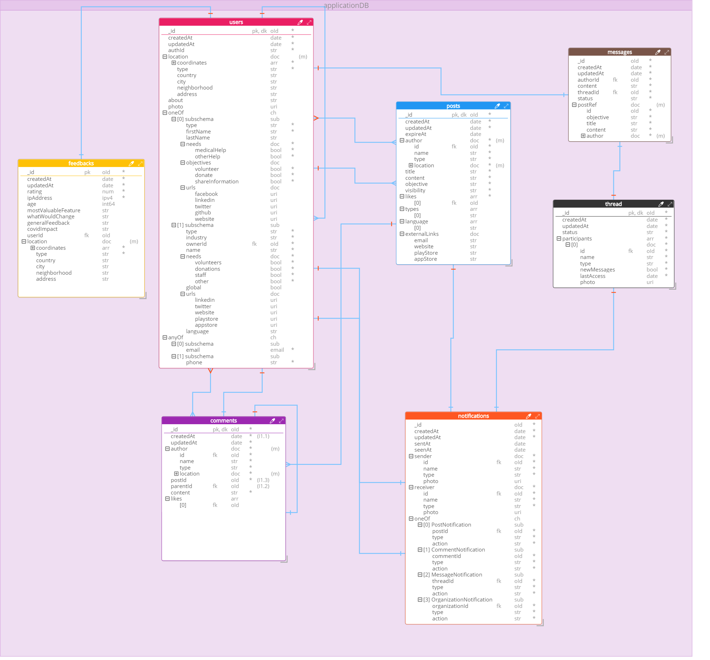

 

# FightPandemics Data Model

 

Repository holding the data model specified as json document, json schema and with its html and pdf documentation.

The data model is versioned, with the current live version being [v1](/v1) and with [v2](/v2) being produced.
 

## Diagram for the Data Model v2

  

 

# Documentation

The documentation can be found in [HTML](v2/docs/FightPandemics_documentation.html) and [PDF](v2/docs/FightPandemics_documentation.pdf). The HTML live version is highly recommended.

There is also an [excel spreadsheet version](v2/docs/FightPandemics.xlsx).

 

## Sample of the documentation

  

 

# Specifications and Scripts

There are [JSON Document](v2/scripts/JSON_Document) and [JSON Schema](v2/scripts/JSON_Schema) representations.

There are [MongoDB Scripts](v2/scripts/MongoDB_Script) available for collection creation, in JS with standard Mongo Shell flavor.

Mongoose scripts are in the roadmap for the near future.

# Collections

## Users

Collection that holds all the data on system's users.

The users can be of **two types**: **(1) Individual**, representing a private user account; and **(2) Organization**, representing an organization of various types.

The field 'type' is used to differentiate between the two subschemas, with 'individual' representing private user accounts and "Community", "Government", "Health care provider", "Non-profit", "Other", "R&D", "Startup", "Traditional Company" and "University".

For more detailed information, please visit the [documentation](v2/docs/FightPandemics_documentation.html).

 

  

 

## Posts

Document to represent a post, asking or offering help to be displayed on the feed. A post can be created by any user, wether it is an individual or an organization. A post can have it's visibility limited geographically and have an expiration date set.

For more detailed information, please visit the [documentation](v2/docs/FightPandemics_documentation.html).

 

  

 

## Comments

Document that represents a comment made at a post. A comment can be made by an individual user or an organization.

For more detailed information, please visit the [documentation](v2/docs/FightPandemics_documentation.html).

 

  

 

## Feedback

Document that represents a feedback sent by an user, logged or not.

For more detailed information, please visit the [documentation](v2/docs/FightPandemics_documentation.html).

 

  

 
